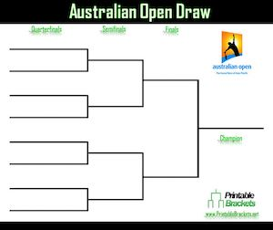

# Disclaimer
This was my assignment at the University of Prince Edward Island. 
The assignment was provided by my professor Andrew Godbout and many thanks
to my help center tutor William Taylor for his help in this assignment. 

2 years later now, I have revised the solution for getMatchesForPlayer method. 
It was correct before but I took an algorithmic approach, which is of course better. 

In short for this assignment, the visualisation tree is provided by my professor. I have provided the JSON string
to the Bracket.json file from my Bracket and Driver program. The interface was provided with the question. 

My task was to create a binary tree data structure from the provided data files by just using arrays. 

# CS2920-A1-W2020
## Tennis Brackets

The organizers of the Australian Open Tennis tournament want you to provide software to keep track of their tennis bracket. 

A tennis bracket (like a March Madness bracket) is the listing of the tennis matches to be played in a single elimination tournament - win a match and move to the next round, lose and you are out. The bracket is a binary tree except every parent node is the winner of the match between their left and right child. 



In this assignment you should create a data structure capable of capturing the essentials for keeping track of tennis matches in each round of a tennis tournament. You should create a simple driver program that allows the tennis organizers to input the matches for a particular round of the tournament (from a file) and also to display textually the matches played for any inputted Tennis Player. Any position in the bracket that is not yet determined should be displayed as a dash: `-`.

See accompanying link for example driver program: https://youtu.be/T40JkVGH0Zc

The tennis organizers already have a visualization website in place (Bracket.html) and your solution must comply with their input requirements, which is a JSON file named Bracket.json outlining the nodes and their children for the whole tennis tournament. Each node must have an associated name and if the node is not a leaf then it should have an array of children, where each child is itself a node. Note that the nodes 

The tennis organizers require a JSON file as follows so they may display the bracket. 

Sample JSON File containing a bracket with only 2 competitors (Bracket.json):

```json
{"name":"andrew","children":[{"name":"andrew"},{"name":"federer"}]}
```
In a more readable format:
```json
{
  "name":"andrew",
  "children": 
  [
    {
      "name":"andrew"
    }, 
    {
      "name":"federer"
    }
  ]
}
```

In the above example a player named andrew is the champion, while there was one match between the two players: federer and andrew. 

Note that the quotes must be present in your JSON file, thus in java you must escape them for them to show up in a String (e.g., ```"\"name\""``` gives name wrapped in quotes).

The webpage the tennis organizers will use is found in: A1-Bracket/bracket.html

This will load the Bracket.json file that you should dynamically create using your driver program.

Note also that we simulate the results of the tennis tournament and they are contained in a number of .txt files. The files are formatted as follows:

`round-X.txt`: contains the tennis matches for round X in the tournament. The matches are all in order with a single tennis player on their own line in the file. 

Using the above example we have 2 tennis rounds. Thus the files would contain the following:

`round-1.txt`:
```
andrew
federer
```

`round-2.txt`:
```
andrew
```

Since there is only one line in round-2.txt we conclude that `andrew` has beaten `federer` in his previous match and is the tournament champion. In `round-1.txt` since `andrew` and `federer` are on lines next to each other we conclude they are playing a match against one another. If there were more matches in the round then the second match participants would appear on lines 3 and 4. You may assume the round files are all part of the same tournament and all maintain the same overall order. That is if `andrew` was on line 1 in `round-1.txt` and he wins his match, then he'll appear as the first line in the next round file. Similiarly if another person won the second match in a given round they would appear on line 2 of the next round. 

## Assumptions: 

A tennis tournament always has a power of 2 participants and this number is known when the bracket is created. 
The organizers will give results in the order they occur, i.e., round 1 then 2 and so so. For the australian open you can create your bracket with 128 competitors.

## Constraints:
You may not use any Java library data structures in this assignment. In other words (other than Scanner or Arrays) **you may not include any Libraries from the java.util package.** Thus no Map or ArrayList or Queue, etc. java.util.Scanner is allowed and java.util.Arrays is allowed only.

## Driver notes:

In your driver program you should have 3 options:

1. Load the results for the next round 
2. Display the matches for a particular player
3. Quit

If the load option is selected then the program should load the appropriate round-x.txt file. If this is the first selection of Load then round-1 should be selected, then round-2 and so on. Upon loading the data into your Bracket you should write out the new JSON into a file named Bracket.json. This file should contain the accumulated results of all data loaded so far and is the file that the provided HTML file will load its data from.

If the display matches for a player option is selected then your program should output the matches played by a particular player starting with the first round through until the player was eliminated from the tournament.

Quiting should exit the program. 

Note you can view the tournament website anytime through your intelliJ project by right clicking the Bracket.html website and choosing open with Browser.

Further note a few sample unit tests are provided to help you out.

For the purposes of unittesting you must supply a file named: `Bracket.java` that contains the following methods exactly (at minimum):

```java

/**
  Constructor 
  @param numCompetitors the number of competitors in the tournament
**/
public Bracket(int numCompetitors) {


/**
  Load the results for a given round into the Bracket
  
  @param round - the round in the tournament being loaded
  @param resultsFile - the file where the results for the given round can be found
**/
public void loadResults(int round, String resultsFile) 

/**
  Return the bracket in JSON format
**/
public String toJSON()

/**
  Return a String of the matches for a given player. Each match should appear on its own line and should only include the opponent name.
  The String starts with the first round match (opponent) for the player, round 2 (if applicable) is on line 2, etc.
**/
public String getMatchesForPlayer(String playerName)
```


Deliverables: 

1. You may work on this project in pairs
2. Your project should be in a repository named using the first names of those involved in the work. For example if I am Andrew and I worked with Roger on this project my repository should be Andrew&Roger. Only one person will create the repository and the other partner will join the repository.
3. `Due: Monday Jan 20, 11:59pm` - A PDF document named `Plan.pdf` must be checked into your repository before the posted date containing the two full names of the participants and student IDs. This document must contain 1 paragraph and one picture describing your proposed solution. You may hand write and scan this document or do it in a word processing file. Your solution may change and this can be crude but must be present by Jan 20 in your repository.
4. `Due: Friday Jan 24, 11:59pm` your completed source code checked into your repository.


Grading: 

1. 1 Point - deliverable 3 above. If this is complete before Jan 20, 11:59pm, you get the single point. 
2. 3 Points - Code readability. Do all methods contain comments describing all of the inputs and the purpose of the method? Are variables named appropriately (camelCase with descriptive names)? Are private variables and temporary variables used correctly? Are repeating math equations encapsulated in their own methods as opposed to repeated throughout the code?
3. 2 Points - Code Design. Is the solution apparent from the code. Are methods used appropriately. 
4. 4 Points - Functionality. Is the driver program easy to use? Is the output correct? Do all of the unit tests pass (including the unittests that the grader has but you do not yet)?

Total: 10 points
